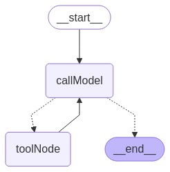

# Nest Next LangChain Project

This project is a **NestJS** and **Next.js** application designed to facilitate seamless communication between the client and server in a conversational mode. It leverages **RxJS** for reactive programming, enabling efficient and real-time data flow between components. Additionally, it incorporates the **LangGraph** framework to enhance AI-driven workflows and streamline graph-based data processing.

## Project Structure

### Application: `server`

The `server` application is the backend service that handles user authentication, thread management, and AI-powered interactions.

### **Workflow Structure**

The following diagram illustrates the workflow structure of the application:



---

### **Main Entry Point**

- **File:** [`main.ts`](apps/server/src/main.ts)  
   The main entry point of the application. It initializes the NestJS application and starts the server.

---

### **Modules**

#### 1. **User Module**

- **Purpose:** Handles user authentication and profile management.
- **Files:**
  - [`user.module.ts`](apps/server/src/app/user.module/user.module.ts): Defines the `UserModule` and its dependencies.
  - [`user.service.ts`](apps/server/src/app/user.module/user.service.ts): Contains business logic for user authentication (signup, signin) and token validation.
  - [`user.controller.ts`](apps/server/src/app/user.module/user.controller.ts): Exposes REST endpoints for user-related operations.

#### 2. **Thread Module**

- **Purpose:** Manages threads and interactions with AI workflows.
- **Files:**
  - [`thread.module.ts`](apps/server/src/app/thread.module/thread.module.ts): Defines the `ThreadModule` and its dependencies.
  - [`thread.service.ts`](apps/server/src/app/thread.module/thread.service.ts): Contains business logic for thread creation, continuation, and retrieval.
  - [`thread.controller.ts`](apps/server/src/app/thread.module/thread.controller.ts): Exposes REST and SSE endpoints for thread-related operations.
  - [`checkpoiner.service.ts`](apps/server/src/app/thread.module/checkpoiner.service.ts): Manages checkpointing using PostgreSQL for AI workflows.
  - [`agent.service.ts`](apps/server/src/app/thread.module/agent.service.ts): Implements AI workflows using LangChain and integrates tools for enhanced functionality.

---

### **Entities**

#### 1. **User Entity**

- **File:** [`user.entity.ts`](apps/server/src/app/postgres-db/entities/user.entity.ts)  
   Represents the `User` table in the database. Includes fields like `id`, `username`, `password`, and relationships with threads.

#### 2. **Thread Entity**

- **File:** [`thread.entity.ts`](apps/server/src/app/postgres-db/entities/thread.entity.ts)  
   Represents the `Thread` table in the database. Includes fields like `id`, `title`, `initialPrompt`, and relationships with users.

---

### **Environment Variables**

The application uses environment variables for configuration. Ensure the following variables are set in a `.env` file:

```env
OPENAI_API_KEY=<your-openai-api-key>
POSTGRES_DB_USERNAME=<your-db-username>
POSTGRES_DB_PASSWORD=<your-db-password>
POSTGRES_DB_HOST=<your-db-host>
POSTGRES_DB_DATABASE=<your-db-name>
POSTGRES_DB_PORT=<your-db-port>
PORT=<application-port>
```

---

### **Environment Variables**

The application uses environment variables for configuration. Ensure the following variables are set in a `.env` file:

```bash
npm install
```

2. Start the server:

   ```bash
   npm run start
   ```

3. Access the application at:
   ```
   http://localhost:<PORT>
   ```

---

### **Endpoints Overview**

#### **User Endpoints**

- `POST /user/signup`: Register a new user.
- `POST /user/signin`: Authenticate a user and retrieve a token.
- `GET /user/profile`: Get the authenticated user's profile.

#### **Thread Endpoints**

- `POST /thread`: Create a new thread.
- `POST /thread/:threadId/continue`: Continue a thread with a new prompt.
- `GET /thread`: Retrieve all threads for the authenticated user.
- `GET /thread/:threadId`: Retrieve a specific thread.
- `GET /thread/:threadId/message`: Retrieve messages for a thread.

---

### **Key Features**

- **User Authentication:** Secure signup and signin with JWT-based token validation.
- **Thread Management:** Create and manage threads with AI-driven interactions.
- **AI Workflows:** Powered by LangChain, enabling advanced AI capabilities.
- **PostgreSQL Integration:** Persistent storage for users, threads, and checkpoints.

---

### Application: `client`

The `client` application is the frontend service built with **Next.js**. It provides a user interface for authentication, thread management, and AI-powered interactions.

#### **Main Entry Point**

- **File:** [`page.tsx`](apps/client/src/app/page.tsx)  
   The main entry point of the client application. It renders the authentication page.

---

#### **Components**

1. **Authentication Component**

   - **File:** [`index.tsx`](apps/client/src/app/components/index.tsx)  
     Handles user authentication (sign-in and sign-up) and redirects authenticated users to the thread page.

2. **Thread Component**

   - **File:** [`index.tsx`](apps/client/src/app/thread/components/index.tsx)  
     Manages thread creation and displays a list of threads for the authenticated user.

3. **Chatbot Component**
   - **File:** [`chatbot.tsx`](apps/client/src/app/thread/[threadId]/components/chatbot.tsx)  
     Handles AI-driven conversations within a specific thread.

---

#### **Routes**

1. **Authentication Page**

   - **File:** [`page.tsx`](apps/client/src/app/page.tsx)  
     Displays the authentication form for users to sign in or sign up.

2. **Thread List Page**

   - **File:** [`page.tsx`](apps/client/src/app/thread/page.tsx)  
     Displays a list of threads and allows users to create new threads.

3. **Thread Detail Page**
   - **File:** [`page.tsx`](apps/client/src/app/thread/[threadId]/page.tsx)  
     Displays the chatbot interface for a specific thread.

---

#### **TypeScript Declarations**

- **File:** [`index.d.ts`](apps/client/index.d.ts)  
   Declares module definitions for importing `.svg` files as React components.

---

#### **Key Features**

- **Authentication:** Users can sign up or sign in to access their threads.
- **Thread Management:** Users can create, view, and interact with threads.
- **AI-Powered Conversations:** Seamless integration with AI workflows for thread-based interactions.
- **Responsive Design:** Optimized for various screen sizes and devices.

---

### **License**

This project is licensed under the MIT License.
